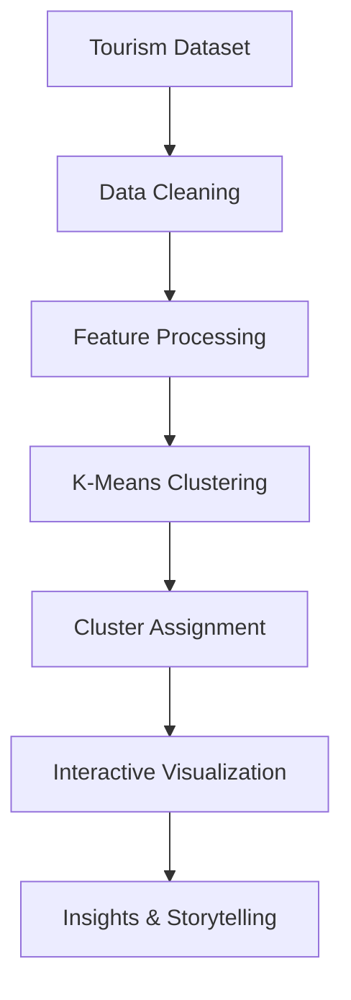

<div align="center">

# 🌴 Discovering Bali Through Data

### Exploring Bali's Tourism Ecosystem Through Data, Geography, and Machine Learning

<p>
An interactive analytics experience that transforms tourism data into meaningful insights through clustering, visualization, and storytelling.
</p>

<br>


</div>

---

## Overview

Discovering Bali Through Data is an interactive data visualization dashboard designed to uncover hidden patterns within Bali's tourism landscape.

Using **K-Means Clustering**, geographic mapping, and modern data visualization techniques, this project transforms hundreds of tourism destinations into an engaging analytical experience.

Rather than simply displaying charts, the dashboard focuses on **data storytelling**, helping users understand what the data actually means.

---

## What You'll Discover

### 📍 Tourism Distribution

Understand how destinations are geographically spread across Bali.

### 🌴 Tourism Categories

Identify which types of attractions dominate Bali's tourism ecosystem.

### ⭐ Destination Quality

Explore rating distributions and visitor satisfaction patterns.

### 🧠 Machine Learning Clusters

Discover how destinations are grouped based on similar characteristics.

### 🗺 Spatial Analysis

Visualize clustering results directly on an interactive map.

### 📊 Data Exploration

Search, filter, and investigate destinations through an interactive explorer.

---

## Dashboard Experience

The dashboard is designed around four principles:

- Data Storytelling
- Interactive Exploration
- Geographic Insight
- Modern User Experience

Every visualization is built to answer a question rather than simply display data.

---

## Analysis Workflow



---

## Technology Stack

### Frontend

- HTML5
- CSS3
- Vanilla JavaScript

### Visualization

- Chart.js
- Leaflet.js

### Data Processing

- PapaParse

### Design

- Glassmorphism
- Dark Interface
- Responsive Layout
- Data Storytelling Approach

---

## Project Highlights

✓ Interactive Dashboard

✓ Machine Learning Integration

✓ Geographic Visualization

✓ Responsive Design

✓ Modern UI/UX

✓ Data Storytelling

✓ Tourism Analytics

---

## Dataset

The dashboard analyzes tourism destinations across Bali containing:

| Attribute | Description |
|------------|------------|
| Name | Destination Name |
| Category | Tourism Category |
| Region | Kabupaten/Kota |
| Rating | Visitor Rating |
| Latitude | Geographic Coordinate |
| Longitude | Geographic Coordinate |
| Cluster | K-Means Result |

**761 Tourism Destinations**

---

## Local Setup

Clone repository:

```bash
git clone https://github.com/GusWhyu/visualisasi-wisata-bali.git
```

Run using Live Server:

```bash
Open index.html with Live Server
```

Make sure:

```text
bali_wisata_hasil_cluster.csv
```

is located in the project root directory.

---

## Screenshots

Add your screenshots here.

```md


```

---

## Author

### Wahyu Agus Dwiyanto

Frontend Developer • UI Designer • Data Visualization Enthusiast

Building beautiful interfaces and meaningful digital experiences.

---

<div align="center">

### Transforming Tourism Data Into Meaningful Insights

</div>
